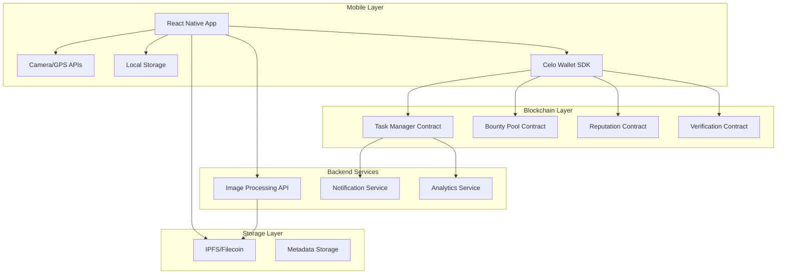

# Design Document

## Overview

The Micro-Task Bounty Platform is a mobile-first decentralized application that creates a marketplace for real-world micro-tasks. The architecture consists of three main layers: a React Native mobile application, Solidity smart contracts deployed on Celo, and a decentralized storage layer for task submissions. The platform enables task creators to post bounties and workers to earn cryptocurrency by completing location-based verification tasks.

The system uses a peer-verification consensus mechanism to ensure task quality without centralized oversight, implements a reputation system to incentivize honest participation, and leverages Celo's mobile-first blockchain infrastructure for fast, low-cost transactions suitable for micro-payments.

## Architecture

### High-Level Architecture



### Technology Stack

**Frontend:**
- React Native with Expo for cross-platform mobile development
- React Navigation for routing
- Redux Toolkit for state management
- React Native Maps for location visualization
- Expo Camera for photo capture
- Expo Location for GPS tracking

**Blockchain:**
- Celo blockchain (testnet for development, mainnet for production)
- Solidity 0.8.x for smart contracts
- Hardhat for contract development and testing
- @celo/contractkit for blockchain interaction
- Valora or Celo Wallet for wallet integration

**Storage:**
- IPFS via Web3.Storage for decentralized photo storage
- AsyncStorage for local caching
- Metadata stored on-chain (hashes, timestamps)

**Backend Services (Minimal):**
- Firebase Cloud Functions for push notifications
- Image compression/processing API
- Analytics dashboard (optional)

## Components and Interfaces

### Smart Contract Architecture

#### 1. TaskManager Contract

**Purpose:** Manages task lifecycle, creation, assignment, and completion.

**Key Functions:**
```solidity
function createTask(
    string memory description,
    TaskCategory category,
    uint256 bountyAmount,
    uint256 maxWorkers,
    Location memory location,
    uint256 deadline,
    TaskRequirements memory requirements
) external payable returns (uint256 taskId)

function claimTask(uint256 taskId) external returns (bool)

function submitTaskCompletion(
    uint256 taskId,
    string memory ipfsHash,
    Location memory submissionLocation
) external returns (uint256 submissionId)

function expireTask(uint256 taskId) external returns (bool)
```

**State Variables:**
```solidity
struct Task {
    uint256 id;
    address creator;
    string description;
    TaskCategory category;
    uint256 bountyAmount;
    uint256 maxWorkers;
    Location location;
    uint256 deadline;
    TaskStatus status;
    uint256 submissionCount;
    uint256 verifiedCount;
}

mapping(uint256 => Task) public tasks;
mapping(address => uint256[]) public workerActiveTasks;
mapping(uint256 => mapping(address => bool)) public taskClaims;
```

#### 2. BountyPool Contract

**Purpose:** Manages escrow of funds, reward distribution, and platform fees.

**Key Functions:**
```solidity
function depositBounty(uint256 taskId) external payable

function distributeReward(
    uint256 taskId,
    address worker,
    uint256 amount
) external onlyTaskManager

function refundBounty(
    uint256 taskId,
    address creator,
    uint256 amount
) external onlyTaskManager

function withdrawPlatformFees() external onlyOwner
```

**State Variables:**
```solidity
mapping(uint256 => uint256) public taskBounties;
uint256 public platformFeePercentage; // 2.5%
uint256 public accumulatedFees;
```

#### 3. VerificationContract

**Purpose:** Implements peer verification consensus mechanism.

**Key Functions:**
```solidity
function stakeForVerification(uint256 submissionId) external payable

function submitVerification(
    uint256 submissionId,
    bool approved,
    string memory feedback
) external

function checkConsensus(uint256 submissionId) external returns (bool)

function distributeVerificationRewards(uint256 submissionId) external
```

**State Variables:**
```solidity
struct Submission {
    uint256 id;
    uint256 taskId;
    address worker;
    string ipfsHash;
    uint256 timestamp;
    Location location;
    VerificationStatus status;
    uint256 approvalCount;
    uint256 rejectionCount;
}

mapping(uint256 => Submission) public submissions;
mapping(uint256 => mapping(address => Vote)) public verificationVotes;
uint256 public constant CONSENSUS_THRESHOLD = 3;
uint256 public constant VERIFICATION_STAKE = 0.1 ether; // 0.1 cUSD
```

#### 4. ReputationContract

**Purpose:** Tracks worker and verifier reputation scores.

**Key Functions:**
```solidity
function updateWorkerReputation(
    address worker,
    bool successful
) external onlyVerificationContract

function updateVerifierReputation(
    address verifier,
    bool accurateVote
) external onlyVerificationContract

function getReputationScore(address user) external view returns (uint256)

function hasCategory Badge(
    address worker,
    TaskCategory category
) external view returns (bool)
```

**State Variables:**
```solidity
struct ReputationData {
    uint256 score;
    uint256 tasksCompleted;
    uint256 tasksRejected;
    uint256 verificationsPerformed;
    mapping(TaskCategory => uint256) categorySuccesses;
    mapping(TaskCategory => bool) categoryBadges;
}

mapping(address => ReputationData) public reputations;
uint256 public constant INITIAL_REPUTATION = 50;
uint256 public constant BADGE_THRESHOLD = 10;
```

### Mobile Application Architecture

#### Component Structure

```
src/
├── components/
│   ├── TaskCard.tsx
│   ├── TaskMap.tsx
│   ├── CameraCapture.tsx
│   ├── VerificationCard.tsx
│   └── ReputationBadge.tsx
├── screens/
│   ├── TaskFeedScreen.tsx
│   ├── TaskDetailScreen.tsx
│   ├── TaskCompletionScreen.tsx
│   ├── VerificationScreen.tsx
│   ├── WalletScreen.tsx
│   ├── ProfileScreen.tsx
│   └── LeaderboardScreen.tsx
├── services/
│   ├── blockchain.service.ts
│   ├── ipfs.service.ts
│   ├── location.service.ts
│   ├── camera.service.ts
│   └── notification.service.ts
├── store/
│   ├── taskSlice.ts
│   ├── walletSlice.ts
│   ├── userSlice.ts
│   └── verificationSlice.ts
├── hooks/
│   ├── useContract.ts
│   ├── useLocation.ts
│   ├── useWallet.ts
│   └── useReputation.ts
└── utils/
    ├── contracts.ts
    ├── validation.ts
    └── formatting.ts
```

#### Key Mobile Services

**BlockchainService:**
```typescript
class BlockchainService {
  async connectWallet(): Promise<string>
  async getTaskById(taskId: number): Promise<Task>
  async claimTask(taskId: number): Promise<TransactionReceipt>
  async submitTask(taskId: number, ipfsHash: string, location: Location): Promise<TransactionReceipt>
  async stakeForVerification(submissionId: number): Promise<TransactionReceipt>
  async submitVerification(submissionId: number, approved: boolean): Promise<TransactionReceipt>
  async getReputationScore(address: string): Promise<number>
}
```

**IPFSService:**
```typescript
class IPFSService {
  async uploadImage(imageUri: string): Promise<string>
  async uploadMetadata(data: SubmissionMetadata): Promise<string>
  async retrieveImage(ipfsHash: string): Promise<string>
  async compressImage(imageUri: string, maxSize: number): Promise<string>
}
```

**LocationService:**
```typescript
class LocationService {
  async getCurrentLocation(): Promise<Location>
  async checkProximity(userLocation: Location, taskLocation: Location, radius: number): Promise<boolean>
  async requestLocationPermission(): Promise<boolean>
  watchLocation(callback: (location: Location) => void): Subscription
}
```

## Data Models

### On-Chain Data Structures

```solidity
enum TaskCategory {
    PHOTO_VERIFICATION,
    LOCATION_CHECK,
    SURVEY,
    PRICE_MONITORING,
    BUSINESS_HOURS
}

enum TaskStatus {
    ACTIVE,
    IN_PROGRESS,
    COMPLETED,
    EXPIRED,
    CANCELLED
}

enum VerificationStatus {
    PENDING,
    VERIFIED,
    REJECTED,
    DISPUTED
}

struct Location {
    int256 latitude;  // Scaled by 1e6
    int256 longitude; // Scaled by 1e6
    uint256 radius;   // In meters
}

struct TaskRequirements {
    uint8 photoCount;
    bool requiresLocation;
    uint256 minReputation;
    TaskCategory requiredBadge;
}

struct Vote {
    bool hasVoted;
    bool approved;
    uint256 timestamp;
}
```

### Off-Chain Data Models (TypeScript)

```typescript
interface Task {
  id: number;
  creator: string;
  description: string;
  category: TaskCategory;
  bountyAmount: string;
  maxWorkers: number;
  location: Location;
  deadline: number;
  status: TaskStatus;
  requirements: TaskRequirements;
  submissionCount: number;
  verifiedCount: number;
}

interface Submission {
  id: number;
  taskId: number;
  worker: string;
  ipfsHash: string;
  timestamp: number;
  location: Location;
  status: VerificationStatus;
  approvalCount: number;
  rejectionCount: number;
}

interface SubmissionMetadata {
  taskId: number;
  worker: string;
  photos: string[]; // IPFS hashes
  location: Location;
  timestamp: number;
  deviceInfo: DeviceInfo;
}

interface UserProfile {
  address: string;
  reputationScore: number;
  tasksCompleted: number;
  totalEarnings: string;
  categoryBadges: TaskCategory[];
  activeTasks: number[];
}
```

## Error Handling

### Smart Contract Error Handling

**Custom Errors:**
```solidity
error InsufficientBounty(uint256 provided, uint256 required);
error TaskNotActive(uint256 taskId);
error WorkerAlreadyClaimed(address worker, uint256 taskId);
error MaxActiveTasksReached(address worker);
error OutsideLocationRadius(Location required, Location provided);
error DeadlineExpired(uint256 taskId, uint256 deadline);
error InsufficientStake(uint256 provided, uint256 required);
error AlreadyVerified(uint256 submissionId);
error UnauthorizedAccess(address caller);
error ConsensusNotReached(uint256 submissionId);
```

**Error Recovery:**
- Failed transactions: Retry with increased gas limit
- Consensus disputes: Escalate to additional verifiers
- Expired tasks: Automatic refund to creator
- Network failures: Queue transactions locally, retry on reconnection

### Mobile Application Error Handling

**Network Errors:**
```typescript
class NetworkErrorHandler {
  async retryTransaction(tx: Transaction, maxRetries: number = 3): Promise<Receipt>
  async queueOfflineSubmission(submission: Submission): Promise<void>
  async syncPendingTransactions(): Promise<void>
}
```

**User-Facing Error Messages:**
- "Unable to connect to wallet. Please check your internet connection."
- "Task has expired. Returning to task feed."
- "Location services required. Please enable GPS."
- "Insufficient balance for verification stake."
- "Photo upload failed. Retrying..."

**Error Logging:**
- Log all errors to local storage
- Send critical errors to analytics service
- Display user-friendly messages
- Provide retry options

## Testing Strategy

### Smart Contract Testing

**Unit Tests (Hardhat):**
```javascript
describe("TaskManager", () => {
  it("should create task with valid parameters")
  it("should prevent task creation with insufficient bounty")
  it("should allow worker to claim available task")
  it("should prevent claiming more than 3 active tasks")
  it("should accept submission within location radius")
  it("should reject submission outside location radius")
  it("should expire task after deadline")
  it("should refund bounty on task expiration")
})

describe("VerificationContract", () => {
  it("should accept verification stake")
  it("should reach consensus with 3 approvals")
  it("should distribute rewards on consensus")
  it("should handle verification disputes")
  it("should penalize dishonest verifiers")
})

describe("ReputationContract", () => {
  it("should increase reputation on successful task")
  it("should decrease reputation on rejected task")
  it("should award category badge after 10 successes")
  it("should apply reputation multiplier")
})
```

**Integration Tests:**
- Full task lifecycle: creation → claim → submission → verification → reward
- Multi-worker scenarios with concurrent submissions
- Verification consensus with mixed votes
- Reputation updates across multiple tasks
- Bounty pool fund management

**Security Tests:**
- Reentrancy attack prevention
- Access control verification
- Integer overflow/underflow checks
- Front-running protection
- Gas optimization validation

### Mobile Application Testing

**Component Tests (Jest + React Native Testing Library):**
```typescript
describe("TaskCard", () => {
  it("renders task details correctly")
  it("displays distance from user location")
  it("shows claim button for available tasks")
  it("disables claim button when max tasks reached")
})

describe("CameraCapture", () => {
  it("requests camera permission")
  it("captures photo with metadata")
  it("compresses image before upload")
  it("validates photo quality")
})
```

**Integration Tests:**
- Wallet connection flow
- Task claiming and submission flow
- Verification participation flow
- Offline mode and sync
- Location-based task filtering

**E2E Tests (Detox):**
```typescript
describe("Complete Task Flow", () => {
  it("should allow user to discover, claim, complete, and earn reward from task", async () => {
    await device.launchApp();
    await element(by.id('task-feed')).tap();
    await element(by.id('task-0')).tap();
    await element(by.id('claim-button')).tap();
    await element(by.id('start-task')).tap();
    await element(by.id('camera-capture')).tap();
    await element(by.id('submit-button')).tap();
    await expect(element(by.text('Submission successful'))).toBeVisible();
  });
});
```

**Performance Tests:**
- App launch time < 3 seconds
- Task feed load time < 2 seconds
- Photo upload time < 5 seconds (on 3G)
- Transaction confirmation time < 10 seconds
- Memory usage < 150MB

### Testing on Celo Testnet

**Testnet Deployment:**
1. Deploy contracts to Celo Alfajores testnet
2. Fund test accounts with testnet cUSD
3. Create sample tasks with various parameters
4. Simulate worker and verifier interactions
5. Monitor gas costs and transaction times
6. Test edge cases and error scenarios

**Load Testing:**
- Simulate 100 concurrent users
- Test with 1000+ active tasks
- Verify contract performance under load
- Monitor gas costs at scale
- Test verification queue processing

## Security Considerations

### Smart Contract Security

**Access Control:**
- Use OpenZeppelin's Ownable and AccessControl
- Implement role-based permissions (TASK_CREATOR, WORKER, VERIFIER)
- Restrict sensitive functions to authorized contracts

**Reentrancy Protection:**
- Use ReentrancyGuard on all fund transfer functions
- Follow checks-effects-interactions pattern
- Use pull payment pattern for reward distribution

**Economic Security:**
- Minimum stake requirements prevent spam
- Reputation system incentivizes honest behavior
- Platform fees sustain operations
- Slashing for malicious actors

**Audit Requirements:**
- Pre-launch audit by reputable firm (CertiK, OpenZeppelin, ConsenSys Diligence)
- Bug bounty program post-launch
- Regular security reviews for upgrades

### Mobile Application Security

**Wallet Security:**
- Biometric authentication for transactions
- Secure key storage using device keychain
- Transaction signing on device
- Display transaction details before confirmation

**Data Privacy:**
- Encrypt sensitive data at rest
- Minimize PII collection
- User consent for location sharing
- GDPR compliance for data deletion

**API Security:**
- Rate limiting on backend endpoints
- Input validation and sanitization
- HTTPS for all communications
- JWT authentication for backend services

## Deployment Strategy

### Smart Contract Deployment

**Testnet Phase:**
1. Deploy to Celo Alfajores testnet
2. Conduct internal testing (2 weeks)
3. Beta testing with 50 users (2 weeks)
4. Security audit
5. Fix identified issues

**Mainnet Phase:**
1. Deploy to Celo mainnet
2. Gradual rollout with limited features
3. Monitor for 1 week
4. Enable full features
5. Scale user acquisition

**Contract Upgrade Strategy:**
- Use OpenZeppelin's upgradeable contracts pattern
- Implement proxy pattern for future upgrades
- Multi-sig wallet for upgrade authorization
- Time-lock for critical changes

### Mobile Application Deployment

**Beta Testing:**
- TestFlight (iOS) and Google Play Beta (Android)
- 100 beta testers
- Collect feedback and metrics
- Iterate on UX issues

**Production Release:**
- Submit to App Store and Google Play
- Progressive rollout (10% → 50% → 100%)
- Monitor crash reports and analytics
- Hotfix capability for critical issues

**PWA Deployment:**
- Deploy progressive web app for users without app store access
- Host on Vercel or Netlify
- Enable offline functionality
- Push notification support

## Performance Optimization

### Blockchain Optimization

**Gas Optimization:**
- Use uint256 for loop counters
- Pack struct variables efficiently
- Minimize storage writes
- Use events for off-chain data
- Batch operations where possible

**Transaction Optimization:**
- Estimate gas before transactions
- Use appropriate gas price for urgency
- Implement transaction queuing
- Retry failed transactions with adjusted gas

### Mobile Optimization

**Data Usage Optimization:**
- Cache task data locally
- Compress images before upload
- Lazy load task images
- Implement pagination for task feed
- Defer non-critical uploads to WiFi

**Battery Optimization:**
- Minimize GPS polling frequency
- Use geofencing for location triggers
- Batch network requests
- Optimize image processing
- Background task management

**UI Performance:**
- Use FlatList for long lists
- Implement virtualization
- Optimize re-renders with React.memo
- Use native driver for animations
- Lazy load screens

## Scalability Considerations

### Horizontal Scaling

**Task Distribution:**
- Geographic sharding of tasks
- Category-based task pools
- Load balancing across regions

**Verification Scaling:**
- Parallel verification processes
- Priority queue for high-value tasks
- Automated verification for high-reputation workers

### Future Enhancements

**Phase 2 Features:**
- Multi-chain support (Polygon, Arbitrum)
- Advanced task types (video verification, audio recording)
- Team-based tasks
- Recurring tasks and subscriptions
- API for third-party integrations

**Phase 3 Features:**
- AI-assisted verification
- Reputation NFTs
- Task marketplace with bidding
- Cross-platform rewards
- DAO governance for platform decisions
